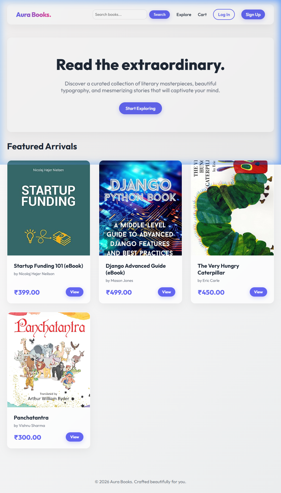
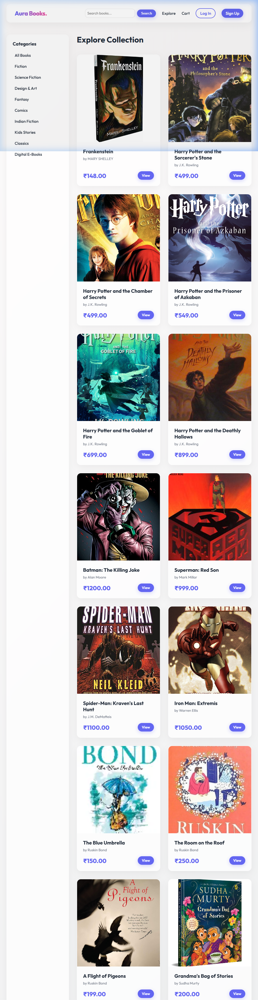

# 📚 Aura Books - Professional Bookstore Project

Aura Books is a high-performance, modern bookstore application built with **Django**. This project focuses on providing a premium user experience with a **Glassmorphism-inspired** design and a fully functional e-commerce flow.

## 🌟 Key Features
- **Sophisticated Catalog**: Dynamic, category-based browsing with a responsive grid layout.
- **Search System**: Robust search functionality for book titles and authors.
- **Modern Admin**: Fully customized backend using the Django Jazzmin management dashboard.
- **Cart & Checkout**: Secure shopping experience with checkout tracking.

## 🛠️ Tech Stack
- **Backend**: Django 5.2 (Python 3.10)
- **Frontend**: Vanilla HTML5, CSS3 (**Emerald Green Theme**), JavaScript
- **Database**: SQLite (Optimized for demonstration and portability)
- **Deployment**: Live Hosting on PythonAnywhere

## 📸 Screenshots

### 🖼️ Homepage

### 📚 Book Catalog

### 🔐 User Login

## 🧠 Technical Decisions & Challenges
During the creation of this project, I made several key technical choices:
1. **Custom CSS Architecture**: I chose to use custom Vanilla CSS instead of a framework like Bootstrap to have full control over the aesthetic and ensure fast page loads.
2. **Session-based Cart**: I implemented a flexible cart system that works for both logged-in users and guests to maximize user experience.
3. **Data Seeding**: I developed custom Python scripts to manage project data and ensure the store was populated with a professional catalog for assessment.

---
*Developed for Academic Project Submission - 2026*
